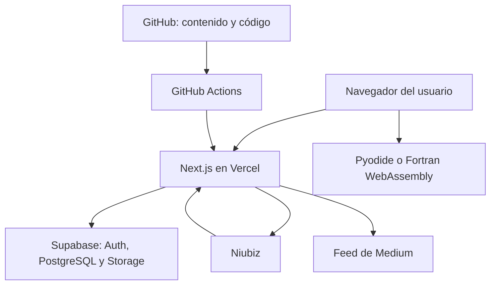
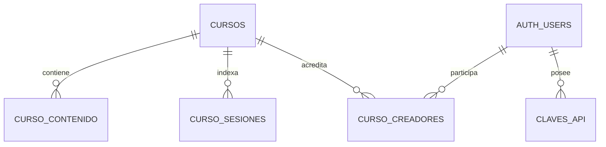
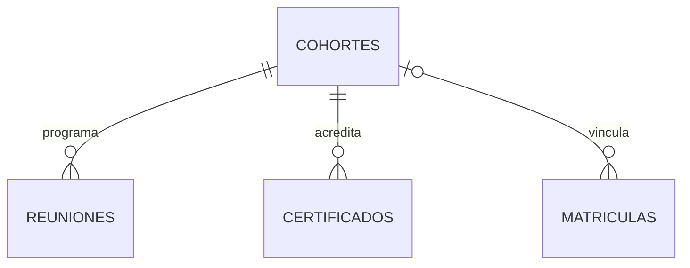
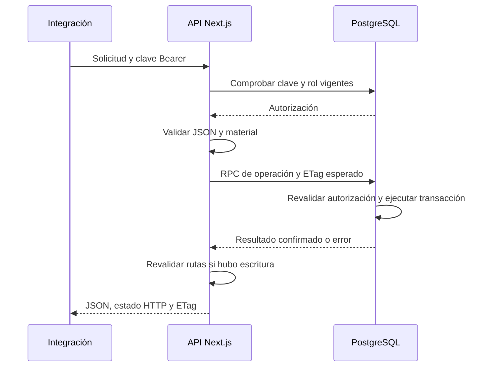
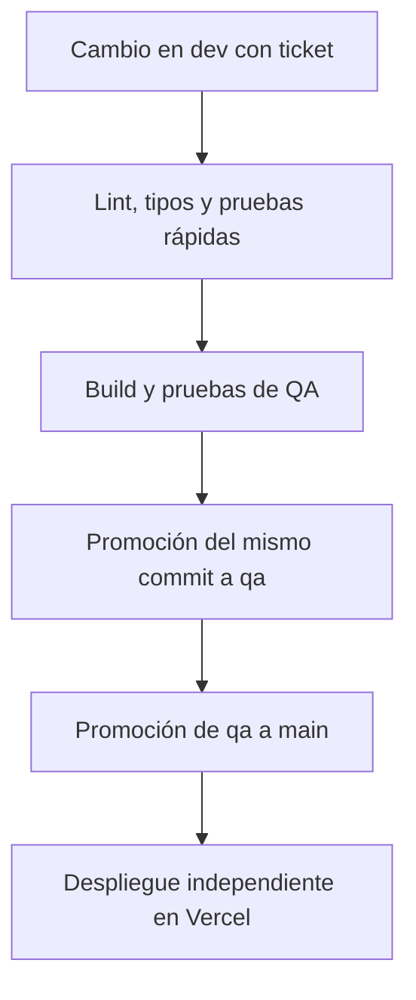

# SSD — Software Design Document de EDUQA.PE

| Campo | Valor |
|---|---|
| Proyecto | EDUQA.PE |
| Versión del documento | 1.0 |
| Fecha de elaboración | 21 de septiembre de 2026 |
| Responsable del proyecto | Alejandro Valentino Seminario Medina |
| Repositorio | [seminarioA/eduqa.pe](https://github.com/seminarioA/eduqa.pe) |
| Aplicación observada | [eduqa-pe.vercel.app](https://eduqa-pe.vercel.app) |
| Base de código analizada | Rama `dev`, commit `b0b83f94877aad0c61cbe001bedac09b002cd4ea` |
| Estado del documento | Diseño documentado; implementación del CRUD seguida en el ticket #11 |

## 1. Propósito y alcance

Este documento describe el diseño de la plataforma educativa EDUQA.PE: responsabilidades de sus componentes, contratos, persistencia, control de acceso, flujos de contenido y operación. Está dirigido al responsable técnico, desarrolladores, docentes que publican material y agentes que colaboran en el repositorio.

Se distinguen tres estados para evitar confundir código disponible con una funcionalidad desplegada:

| Estado | Significado |
|---|---|
| Existente | Está presente en el commit analizado. No implica que todos sus flujos externos hayan sido probados en esta revisión. |
| Implementado localmente | Cambio elaborado y probado durante esta entrega, todavía sin commit ni despliegue. |
| Pendiente | Requiere acceso, verificación del entorno real o una decisión posterior. |

El alcance incluye cursos y microcursos, aulas interactivas, matrículas, progreso, valoraciones, pagos, constancias, calendario, gestión administrativa, API de cursos y publicación continua. No define un servicio de videoconferencia propio, una pasarela de pagos propia ni un servidor para ejecutar código arbitrario de estudiantes.

## 2. Objetivos y requisitos

### 2.1. Objetivos de diseño

- Publicar y actualizar contenido académico sin desplegar nuevamente la aplicación.
- Mantener una identidad estable del curso, un índice coherente con su material y un número de revisión verificable.
- Aplicar el control de acceso en el servidor y en la base de datos, además de las restricciones visibles en la interfaz.
- Separar las funciones de lectura, edición de contenido, configuración comercial y eliminación.
- Conservar la información académica y transaccional cuando un curso deja de estar disponible.
- Permitir ejemplos ejecutables sin trasladar la ejecución del alumno al servidor de la plataforma.

### 2.2. Requisitos funcionales

| ID | Requisito | Componente principal |
|---|---|---|
| RF-01 | Mostrar y clasificar cursos por área, nivel y formato | Catálogo y fichas de cursos |
| RF-02 | Registrar e identificar usuarios | Supabase Auth y perfiles |
| RF-03 | Matricular, completar cursos y consultar avance | Matrículas y progreso |
| RF-04 | Leer sesiones, resolver ejercicios y consultar referencias | Aula y motores de ejecución |
| RF-05 | Crear o reemplazar material Markdown | Panel; API de contenido |
| RF-06 | Gestionar precio, estado, orden y acceso libre | Panel; PATCH de la API local |
| RF-07 | Consultar y eliminar cursos mediante una integración autenticada | CRUD local de API v1 |
| RF-08 | Registrar compras y consultar su estado | Pagos y callback de Niubiz |
| RF-09 | Consultar constancias y reuniones | Certificaciones y calendario |
| RF-10 | Administrar rutas, avisos, reportes y marca | Módulos del panel |
| RF-11 | Sincronizar publicaciones de Medium | Blog y caché del feed |
| RF-12 | Vincular cambios de software a tickets y ejecutar controles antes de promoverlos | GitHub Actions |

### 2.3. Requisitos de calidad

| ID | Criterio verificable |
|---|---|
| RNF-01 | Una operación de escritura de la nueva API confirma todos sus cambios o los revierte completos. |
| RNF-02 | Una clave desconocida o revocada no permite consultar ni modificar cursos mediante la API. |
| RNF-03 | La edición con un ETag desactualizado devuelve 412 y no sobrescribe datos. |
| RNF-04 | La eliminación rechaza referencias académicas o transaccionales existentes y cursos con respaldo local. |
| RNF-05 | Las respuestas privadas de la nueva API no se almacenan en caché compartida. |
| RNF-06 | Los errores de almacenamiento no exponen credenciales ni detalles internos al cliente. |
| RNF-07 | Los cambios de interfaz se verifican renderizados; los ejemplos de cursos se ejecutan y se comparan con sus salidas. |
| RNF-08 | El código mantiene validación de tipos, lint, pruebas pertinentes y compilación de producción. |

No se fijan como resultados medidos una disponibilidad, latencia, concurrencia máxima o capacidad de almacenamiento. Sus objetivos deben acordarse y comprobarse con métricas de producción y pruebas de carga.

## 3. Actores y permisos

| Actor | Responsabilidad y acceso |
|---|---|
| Visitante | Consultar información pública y material que permita acceso libre. |
| Alumno | Gestionar sus matrículas y consultar contenido autorizado, progreso, compras, reuniones y constancias. |
| Profesor | Rol interno con acceso a recursos según los controles de cada página; no equivale automáticamente a administrador. |
| Gestor | Rol interno habilitado por `puedeIntegrar` para emitir y usar claves de API. |
| Desarrollador | Integraciones técnicas mediante claves de API y recursos internos. |
| Agente | Integraciones automatizadas con el mismo control de rol y clave vigente. |
| Administrador | Gestión administrativa. El indicador heredado `es_admin` conserva compatibilidad con cuentas anteriores. |

`esInterno` y `puedeIntegrar` tienen propósitos diferentes. El primero admite también profesores; el segundo admite desarrollador, agente, gestor y admin, además de `es_admin`. No debe asumirse que un rol interno tiene permiso para cualquier acción del panel: varias acciones existentes verifican específicamente `es_admin` y dependen de RLS.

La API local permite gestionar el catálogo a los roles de integración autorizados; no implementa un alcance de clave por curso ni un modelo de múltiples organizaciones. La autoría del curso es una atribución editorial y no una frontera de permisos de esta API.

## 4. Arquitectura general

EDUQA.PE utiliza una aplicación Next.js como unidad principal de despliegue. El servidor renderiza páginas, ejecuta Server Actions y expone Route Handlers. Supabase concentra identidad, persistencia y almacenamiento. La ejecución didáctica ocurre en el navegador o, cuando se indica, en el entorno local del alumno.

El diagrama muestra dependencias lógicas. GitHub Actions promueve ramas; Vercel realiza su propio despliegue. Los archivos Markdown del repositorio se incluyen como respaldo del contenido y no se consultan mediante GitHub durante una petición del alumno.

### 4.1. Tecnologías observadas

| Capa | Tecnología |
|---|---|
| Aplicación | Next.js 16.2.12, App Router |
| Interfaz | React 19.2.4, TypeScript 5, Tailwind CSS 4 |
| Componentes | Radix UI, Lucide, React Icons |
| Contenido | Markdown, YAML, React Markdown, remark-gfm, Shiki |
| Datos e identidad | Supabase, PostgreSQL, Supabase Auth, `@supabase/ssr` |
| Python en navegador | Pyodide; versión fijada en `src/lib/pyodide.ts` |
| Fortran en navegador | Web Worker y distribución WebAssembly de xlfortran |
| Documentos PDF | pdfjs-dist; componentes de constancias y visualización |
| Cobros | Integración QR de Niubiz |
| Publicación | GitHub Actions y Vercel |
| Pruebas SQL del CRUD local | PostgreSQL mediante PGlite, solo como dependencia de desarrollo |

### 4.2. Límites de componentes

- `src/app/`: rutas, páginas, Server Actions y API HTTP.
- `src/components/`: presentación e interacción del usuario; incluye el aula y sus consolas.
- `src/lib/`: acceso a datos, tipos, parser de contenido y reglas compartidas.
- `src/content/`: cursos Markdown y contenido heredado en TypeScript/JSON.
- `supabase/migrations/`: cambios versionados de la base de datos.
- `scripts/`: verificaciones, utilidades y herramientas de desarrollo.
- `public/`: recursos estáticos, trabajadores y motores WebAssembly.

Los módulos que usan secretos o acceso de servidor deben permanecer fuera del paquete cliente. La nueva implementación de la API usa `server-only` y runtime Node.js.

## 5. Módulos funcionales

| Módulo | Rutas o archivos principales | Responsabilidad |
|---|---|---|
| Identidad | `/acceder`, `/registro`, `/auth/confirmar`, `src/proxy.ts` | Inicio de sesión, confirmación y actualización de cookies |
| Catálogo | `/cursos`, `catalogo-cursos.ts`, `precios.ts` | Unificación de contenido y configuración de publicación |
| Aula | `/cursos/[curso]/[leccion]`, `components/curso/` | Renderizado, navegación, ejercicios y progreso |
| Herramientas Python | `/cursos/python/sandbox`, `/cursos/python/quiz` | Práctica y comprobación de conocimiento |
| Rutas formativas | `/rutas/[ruta]`, `/panel/rutas` | Secuencias de cursos, posiciones y requisitos |
| Gestión académica | `/panel/cursos` | Carga de archivos, creación y configuración de cursos |
| Integraciones | `/recursos/api`, `/api/v1/cursos` | Claves y contrato de publicación; CRUD ampliado localmente |
| Pagos | `/pagar/[curso]`, `/api/niubiz/callback` | Solicitud QR y recepción de confirmaciones |
| Compras y constancias | `/compras`, `/certificaciones`, `/certificados/preview` | Consulta de registros y presentación de constancias |
| Calendario | `/calendario`, `reuniones.ts` | Reuniones de las ediciones autorizadas |
| Blog | `/blog`, `/blog/[slug]`, `/panel/blog` | Lectura y actualización del feed de Medium |
| Operación | `/panel/avisos`, `/panel/reportes`, `/panel/marca` | Avisos, incidencias y recursos de marca |
| Perfil y reclamaciones | `/perfil`, `/reclamaciones` | Datos personales, avatar y registro de reclamaciones |

## 6. Diseño del contenido académico

### 6.1. Fuentes y precedencia

El catálogo combina cursos heredados de `src/lib/cursos.ts`, carpetas Markdown detectadas automáticamente y cursos almacenados en la base. Cuando un mismo slug aparece en el repositorio y en la base, el material de la base tiene precedencia.

La configuración de precio, estado, orden y acceso se consulta por separado. Un texto comercial estático del repositorio no debe considerarse la fuente autoritativa del precio vigente de cada curso.

Eliminar una fila de la base no garantiza retirar un curso con respaldo local: podría reaparecer desde el repositorio. La nueva API rechaza esa eliminación y recomienda conservarlo archivado.

### 6.2. Contrato del material

Un curso incluye `curso.md` y al menos una sesión. La ficha declara datos como slug, código base, título, resumen, área, nivel, horas e icono. Las sesiones declaran número, título y opcionalmente slug, paquetes y preludio.

El parser convierte el material en `Curso`, `Leccion`, bloques y secciones del índice. Las sesiones se ordenan por su número. El nombre del archivo y el slug de la sesión son conceptos distintos.

Se admiten bloques de código, salidas, ejercicios con un hueco, notas, referencias y diagramas de Venn. `!sin-consola` marca el código que no debe ofrecerse como ejecución en el navegador.

### 6.3. Regla editorial obligatoria para Python

**Cada ítem del índice desarrolla una sola función, método u operación. Está prohibido agrupar operaciones nuevas dentro del mismo ítem.**

Cada punto tiene un título propio, explicación, ejemplo autónomo, salida verificada, referencia y práctica. Las operaciones auxiliares ya enseñadas pueden reutilizarse sin convertirse en un segundo objetivo del apartado. Las funciones de los proyectos finales se explican por separado; su integración reutiliza lo ya estudiado.

La validez estructural del Markdown no demuestra la calidad pedagógica. La revisión editorial debe rechazar un apartado que incumpla esta regla aunque el parser lo acepte.

### 6.4. Identidad y revisiones

| Elemento | Uso |
|---|---|
| `slug` | Identidad estable en URLs y relaciones de curso |
| `codigo_base` | Prefijo editorial único de cuatro letras mayúsculas |
| `revision` | Número de revisión, entre 1 y 9999 según la migración existente |
| `codigo` | Código generado con formato `ABCD-0001` |
| `revision_hash` | Detección de cambios en título, resumen y material |

`registrar_revision_curso` conserva la revisión cuando el material es idéntico y la incrementa cuando cambia. El hash de revisión es una comparación de contenido, no una firma criptográfica ni una credencial.

### 6.5. Estado verificado de los dos cursos Python

| Curso | Código observado | Sesiones | Ítems individuales | Estado |
|---|---|---:|---:|---|
| Python intermedio | PYIN-0003 | 8 | 57 | Borrador |
| Python avanzado | PYAV-0002 | 8 | 65 | Borrador |

Ambos conservan una duración propuesta de 24 horas. Avanzado tiene 23 ejercicios interactivos y 42 prácticas locales. Las prácticas que requieren procesos, hilos, medición o control del bucle asíncrono no se presentan como compatibles automáticamente con el runtime del navegador.

## 7. Modelo de datos

### 7.1. Entidades principales

| Entidad | Responsabilidad | Campos o relaciones observados |
|---|---|---|
| `auth.users` | Identidad administrada por Supabase | Identificador de usuario |
| `perfiles` | Perfil y permisos de aplicación | id, nombre, teléfono, plan, plan_hasta, es_admin, rol, foto |
| `cursos` | Ficha operativa del curso | slug, título, resumen, precio, estado, acceso_libre, orden, ruta, posición, requisitos, código y revisión |
| `curso_contenido` | Texto original de los archivos | Clave compuesta curso_slug y archivo; contenido; fecha de actualización |
| `curso_sesiones` | Índice de sesiones | curso_slug, archivo, número, título, slug de sesión |
| `curso_creadores` | Atribución editorial | curso_slug, usuario_id, rol editorial, orden |
| `matriculas` | Inscripción y estado académico | usuario_id, curso_slug, estado; referencia opcional a cohorte |
| `progreso` | Lecciones vistas | usuario_id, curso_slug, leccion_slug |
| `valoraciones` | Puntuación de un curso | curso_slug, usuario_id, estrellas |
| `rutas` | Agrupación formativa | slug y metadatos; cursos ordenados por posición |
| `cohortes` | Edición impartida de un curso | Nombre, horas, fecha, docente; identificadores de curso según evolución del esquema |
| `reuniones` | Sesión en vivo de una cohorte | cohorte_id, inicia_en, minutos, enlace, cancelación |
| `pagos` | Operación de cobro | usuario_id, curso_slug, monto, moneda, estado, identificadores externos y trama recibida |
| `certificados` | Constancia emitida | cohorte_id, alumno, email, código, emisión y anulación |
| `claves_api` | Credencial revocable de integración | usuario_id, nombre, prefijo, resumen SHA-256, creación, último uso y revocación |
| `avisos`, `reportes`, `configuracion`, `marca_recursos` | Operación y personalización | Consultados por módulos administrativos específicos |
| `interesados` | Registro de interés definido en una migración | Contacto, cursos solicitados, nivel y origen |

Este inventario no sustituye una extracción del esquema productivo. El repositorio contiene migraciones que resumen cambios aplicados anteriormente y referencias a funciones cuya definición completa no aparece en los archivos revisados. Las claves y restricciones no mostradas deben verificarse contra el esquema real antes de otra migración.

### 7.2. Relaciones confirmadas en migraciones

Las cohortes históricas declaran `curso_id` como texto, sin clave foránea hacia `cursos` en la migración inicial. Código posterior consulta también `curso_slug`. Esta evolución debe reconciliarse en el esquema real; no se dibuja una relación física que no está confirmada.

### 7.3. Invariantes

- El índice y los archivos publicados describen el mismo conjunto de sesiones.
- Un curso conserva su código base cuando se vuelve a publicar.
- No se repiten número ni slug de sesión en un envío válido a la nueva API.
- Una matrícula completada conserva el acceso contemplado por `estaMatriculado` y libera un cupo del límite de matrículas activas.
- El nombre impreso en una constancia es una instantánea: cambiar el perfil no debe alterar una constancia ya emitida.
- La clave API original no se almacena; se compara su resumen.
- Eliminar material no debe eliminar registros académicos o económicos asociados.

## 8. Flujos principales

### 8.1. Apertura del aula

1. Next.js resuelve el curso y la lección solicitados.
2. El catálogo combina respaldo local e información de la base, con precedencia de esta última.
3. El servidor determina acceso libre, usuario, privilegios administrativos y matrícula.
4. Las consultas de contenido se ejecutan con la sesión del usuario y quedan sujetas a RLS.
5. La interfaz renderiza el índice y los bloques permitidos; prepara el runtime cuando corresponde.
6. Marcar una lección como vista realiza un upsert de progreso y revalida el catálogo.

Los motores de navegador no reciben la clave de servicio del servidor. Que un ejemplo corra en WebAssembly no debe describirse como garantía universal de aislamiento frente a todo recurso del navegador; su superficie depende del runtime y de las capacidades que exponga.

### 8.2. Publicación desde el panel existente

El panel comprueba usuario y administración, lee los archivos, construye el curso y valida su configuración. Guarda ficha, material e índice; retira archivos obsoletos, registra la revisión y revalida rutas.

**Límite existente:** esas escrituras se realizan mediante varias llamadas a la base. La secuencia intenta evitar un curso vacío, pero no equivale a una única transacción de publicación. La nueva RPC de la API resuelve la atomicidad para la API; migrar el panel a un mecanismo equivalente sigue pendiente.

### 8.3. Escritura mediante el CRUD local

La autorización se comprueba nuevamente en la RPC que escribe, de modo que una comprobación anterior no sea por sí sola un permiso permanente.

### 8.4. Cobro QR existente

1. Un usuario solicita un pago y el servidor registra la operación.
2. El servidor solicita un token y un QR a Niubiz.
3. El usuario paga desde una billetera compatible.
4. El callback localiza el pago, aplica el filtro de origen configurado y compara el monto.
5. Si ya estaba pagado, responde de forma idempotente; si corresponde, actualiza el estado.

El código atribuye la activación del plan a un trigger de base de datos. Esta revisión no ejecutó un cobro real ni verificó ese trigger en producción. Los comentarios del código sobre el protocolo de Niubiz no sustituyen la validación del contrato vigente del proveedor.

## 9. API de cursos

### 9.1. Situación actual y ampliación

El commit base expone únicamente `POST /api/v1/cursos`, con autenticación por clave y guardado mediante `publicar_curso_por_api`.

La ampliación implementada localmente utiliza `src/lib/cursos-api.ts`, dos Route Handlers y la RPC `gestionar_curso_por_api`. Su contrato completo está en `docs/api-cursos.md` y en el contenido actualizado de `/recursos/api`.

| Método | Ruta | Semántica de la ampliación |
|---|---|---|
| GET | `/api/v1/cursos` | Listado paginado de cursos persistidos; no incorpora por sí solo el respaldo local |
| POST | `/api/v1/cursos` | Crear o reemplazar contenido completo, compatible con el comportamiento de actualización previo |
| GET | `/api/v1/cursos/{slug}` | Obtener metadatos actuales, archivos, sesiones y ETag |
| PUT | `/api/v1/cursos/{slug}` | Reemplazar contenido de un curso existente |
| PATCH | `/api/v1/cursos/{slug}` | Modificar precio, estado, acceso_libre u orden |
| DELETE | `/api/v1/cursos/{slug}` | Eliminación física condicionada y protegida con If-Match |

Publicar corresponde a establecer `estado: publico`; guardar material y hacerlo visible son operaciones relacionadas, pero distintas. POST y PUT pueden declarar estado en la ficha. Si no se declara al editar, se conserva el existente.

### 9.2. Validación y concurrencia

- JSON de hasta 2 MiB; `Content-Type: application/json` en escrituras con cuerpo.
- Una ficha y entre una y 99 sesiones, con nombres `.md` sin rutas y contenidos de texto.
- Identidad consistente entre URL, cuerpo y ficha; icono válido y metadatos comprobados.
- Validación de paquetes y preludio para evitar material que el aula no pueda interpretar correctamente.
- POST y PUT reemplazan el conjunto completo de archivos; lo omitido se retira en la misma transacción.
- Bloqueo por curso para serializar operaciones de la API y bloqueo de fila para proteger el registro existente.
- ETag derivado de la ficha persistida y su revisión. `If-Match` es opcional al editar y obligatorio al eliminar.
- El ETag cambia también con la configuración comercial; el código de revisión del material no tiene por qué cambiar al modificar solo precio o estado.

PATCH modifica la configuración persistida y no reescribe el YAML original de `curso.md`. GET devuelve ambos datos por separado. Al reenviar material, los campos de publicación que aparezcan explícitamente en el YAML se aplican otra vez; omitirlos conserva la configuración actual.

### 9.3. Eliminación

DELETE requiere un curso en borrador o archivado, una versión coincidente y ausencia de dependencias. La implementación comprueba referencias por claves foráneas, requisitos de otros cursos, cohortes históricas, pagos y progreso, además del respaldo local.

La respuesta exitosa contiene `eliminado: true`. No existe una papelera añadida por este diseño. Un curso con actividad asociada debe conservarse archivado.

Las relaciones históricas sin clave foránea constituyen una limitación de integridad del esquema: las comprobaciones de la API protegen los registros existentes al ejecutar la operación, pero todos los caminos de escritura de relaciones deben respetar también la existencia del curso. Normalizar esas relaciones es un trabajo de esquema posterior.

### 9.4. Errores

| HTTP | Condición |
|---:|---|
| 400 | JSON, estructura o parámetros inválidos |
| 401 / 403 | Clave inválida o revocada / rol insuficiente |
| 404 | Curso inexistente |
| 409 | Identidad o código en conflicto; eliminación impedida |
| 412 / 428 | Versión desactualizada / precondición requerida ausente |
| 413 / 415 | Cuerpo demasiado grande / tipo de contenido no admitido |
| 422 | Metadatos o material inválidos |
| 500 / 503 | Fallo interno / configuración del servidor incompleta |

La ampliación conserva respuestas exitosas HTTP 200 para compatibilidad con el POST previo. El contrato no promete entrega exactamente una vez, una cola de reintentos o idempotencia general de todas las operaciones. Reenviar el mismo material conserva su revisión; repetir DELETE tras el borrado devuelve 404.

## 10. Seguridad y manejo de datos

### 10.1. Sesiones y RLS

`clienteServidor` utiliza cookies y Supabase SSR. `usuarioActual` verifica el usuario mediante `getUser`. El proxy actualiza la sesión y redirige algunas rutas protegidas; la autorización definitiva corresponde a cada operación y a las políticas de la base.

Las políticas de contenido distinguen ficha, material público, acceso libre, matrícula y administración. Las consultas de compras, progreso y reuniones confían en RLS; por tanto, sus políticas reales forman parte del contrato de seguridad y deben auditarse junto con el código.

### 10.2. Credenciales de integración

La nueva RPC se define como `SECURITY INVOKER`, con ejecución concedida a `service_role` y revocada para `PUBLIC`, `anon` y `authenticated`. Solo el servidor dispone de esa credencial. Dentro de la RPC se comprueban la clave API, su revocación y el rol vigente del titular.

No se amplía el acceso directo del navegador a las tablas para soportar el CRUD. La nueva función no modifica automáticamente las firmas heredadas de publicación; su revisión y retirada, si corresponde, debe planificarse por separado para preservar integraciones existentes.

### 10.3. Datos sensibles

Perfiles, matrículas, compras, enlaces de reunión, correos de constancias y claves requieren acceso limitado. Los registros de errores no deben contener tokens ni secretos. Las respuestas de error de la nueva API ocultan los detalles internos de almacenamiento.

La aplicación utiliza Supabase Storage para avatares. El registro de marca observado usa `marca_recursos`. El acceso y las restricciones de carga deben verificarse en sus acciones y políticas, sin asumir una política global para todos los recursos.

### 10.4. Configuración de entorno

| Variable o grupo | Uso |
|---|---|
| `NEXT_PUBLIC_SUPABASE_URL` | Proyecto Supabase al que apunta el despliegue |
| `NEXT_PUBLIC_SUPABASE_PUBLISHABLE_KEY` | Cliente público y SSR con sesión |
| `SUPABASE_SERVICE_ROLE_KEY` | Operaciones privilegiadas solo en el servidor; requerida por el CRUD local |
| `NEXT_PUBLIC_SITIO_URL` | URL de retorno de autenticación |
| `NIUBIZ_ENTORNO`, `NIUBIZ_USUARIO`, `NIUBIZ_CLAVE`, `NIUBIZ_COMERCIO` | Integración de cobro |
| `NIUBIZ_CALLBACK_SIN_FILTRO` | Excepción de filtro presente en el código; no debe habilitarse como configuración normal de producción |
| `MEDIUM_FEED_URL`, `NEXT_PUBLIC_MEDIUM_USERNAME` | Fuente del blog |

El SSD no incluye valores de credenciales ni presupone que una variable esté configurada en producción. La URL de Supabase procede del entorno; no debe deducirse el proyecto correcto por similitud de nombres.

## 11. Rendimiento y disponibilidad

- El parser se ejecuta en el servidor; el contenido se transforma a estructuras que renderiza el aula.
- Se comparte la preparación de Pyodide por pestaña para evitar descargas e inicializaciones repetidas.
- Fortran usa un trabajador y administra carga, ejecución, cancelación y liberación de recursos.
- El feed de Medium utiliza revalidación temporal y por etiqueta; un fallo no debe producir artículos ficticios.
- La nueva API limita el tamaño de entrada y pagina el listado.
- Después de una mutación se revalidan catálogo, panel, rutas y aula del curso.

Antes de incrementar considerablemente el catálogo debe medirse el costo de cargar y reconstruir cursos completos. Una evolución posible es separar consulta de listado y carga diferida de una sesión; no se afirma que esa optimización esté implementada.

## 12. Publicación, migraciones y recuperación

### 12.1. Flujo de código

Los PR se dirigen a `dev`. Cada commit debe referenciar un issue real mediante `Refs`, `Closes` o equivalente. No se publican cambios directamente en `qa` ni en `main`. El workflow condiciona las pruebas Fortran a los archivos y dependencias afectados.

La protección técnica de ramas depende de la configuración y del plan del repositorio. La existencia del workflow no demuestra por sí sola que un administrador no pueda saltarse ese proceso.

### 12.2. Secuencia para la nueva API

1. Habilitar el acceso necesario y crear o vincular tickets reales.
2. Contrastar el esquema objetivo con las tablas y funciones que requiere la migración.
3. Aplicar y verificar `20260921061842_crud_cursos_api.sql` en el entorno autorizado antes de activar los nuevos handlers.
4. Confirmar `SUPABASE_SERVICE_ROLE_KEY` solo en el servidor.
5. Incorporar el cambio a `dev`, ejecutar CI y permitir la promoción prevista.
6. Verificar en el despliegue una creación, consulta, edición y eliminación con datos de prueba identificados para ese fin.
7. Registrar evidencias y cerrar únicamente los tickets resueltos.

La migración nueva añade una función y permisos de ejecución; no necesita borrar los cursos existentes. No se ha aplicado a producción durante esta entrega.

### 12.3. Recuperación

Para una regresión de aplicación, volver a una versión verificada mediante el proceso de despliegue. Una eliminación física de curso requiere un respaldo o restauración administrativa: el ETag no es un mecanismo de recuperación.

Las revisiones detectan cambios, pero las tablas observadas no constituyen un historial completo de todas las versiones de los archivos. Deben acordarse y probarse la política de copias, retención, RPO y RTO. Este documento no atribuye backups o recuperación puntual a un plan de Supabase que no se ha comprobado.

## 13. Verificación y criterios de aceptación

| Área | Evidencia disponible en esta entrega |
|---|---|
| Python intermedio | 57 puntos; ejemplos y ejercicios verificados; carga PYIN-0003 |
| Python avanzado | 65 puntos; 195 ejecuciones al releer el Markdown final; carga PYAV-0002 |
| Proyecto avanzado | 12 casos: límites, entradas inválidas, errores, cancelación y ausencia de tareas huérfanas |
| Aula avanzado | Ocho sesiones inspeccionadas; ancho de página 1348 px sin desbordamiento horizontal; captura guardada |
| API local | Pruebas automatizadas contra PostgreSQL de prueba, incluidas autorización, ETag, rollback y dependencias |
| HTTP local | Pruebas contra Next.js compilado y supabase-js real, con transporte PostgREST local y PostgreSQL de prueba |
| Calidad de código | Compilación de producción y comprobación de tipos; lint sin errores en los archivos modificados |
| Regresiones rápidas | Catálogo, acciones del panel, tickets de commit y herramientas Python ejecutadas |
| Producción de la API | Pendiente: migración, despliegue y prueba contra el proyecto Supabase real |

Los totales finales de pruebas de la API se registran en el informe de entrega para no presentar como definitivo un conteo que cambie al ampliar casos. Las pruebas locales no validan las políticas o triggers no reproducidos del entorno productivo. No se realizaron pruebas de carga ni un cobro real.

### Criterios de cierre del CRUD

- Los seis contratos HTTP documentados responden correctamente y respetan autorización.
- Un reemplazo elimina archivos obsoletos sin dejar ficha e índice desfasados.
- Un fallo de escritura revierte toda la operación.
- Una clave revocada o un rol retirado deja de poder operar.
- Una eliminación con actividad asociada, respaldo local o ETag desactualizado se rechaza.
- El despliegue real supera una comprobación con datos de prueba.
- Los tickets muestran el cambio y su evidencia de verificación antes de cerrarse.

## 14. Decisiones y límites pendientes

| ID | Decisión o hallazgo | Consecuencia |
|---|---|---|
| D-01 | Mantener Next.js como unidad de despliegue | No se introducen microservicios para el CRUD. |
| D-02 | Mantener Markdown como fuente del curso | El autor no necesita editar componentes TypeScript para publicar material. |
| D-03 | Conservar respaldo local con precedencia de la base | Se protege la eliminación para evitar reapariciones. |
| D-04 | Usar una RPC transaccional para el nuevo CRUD | El contenido, índice y revisión se confirman juntos. |
| D-05 | Separar contenido y configuración | PUT reemplaza material; PATCH modifica campos operativos. |
| D-06 | Proteger DELETE y conservar cursos con actividad | La alternativa operativa es archivar. |
| D-07 | Mantener autorización por rol vigente | La autoría y el identificador de clave no otorgan permisos adicionales. |
| D-08 | Exigir una operación por ítem de Python | La regla editorial es obligatoria; su validación semántica sigue siendo humana. |
| P-01 | Acceso a GitHub recuperado el 21 de septiembre de 2026 | Tickets #11 (CRUD), #12 (cursos), #13 (SSD) y #14 (acceso por código); cada commit debe referenciarlos. |
| P-02 | Proyecto Supabase productivo no disponible para esta migración | La API queda implementada y probada localmente, pendiente de aplicar y verificar. |
| P-03 | Historial de migraciones incompleto como reproducción del entorno | Verificar esquema y políticas reales antes de prometer una instalación desde cero. |
| P-04 | Publicación del panel usa varias escrituras | Unificarla con un mecanismo transaccional requiere trabajo adicional. |
| P-05 | Cohortes y otros vínculos históricos pueden usar texto sin FK | Reconciliar identificadores y restricciones para integridad entre todos los escritores. |
| P-06 | Nombres visibles de estados no son uniformes | Alinear “privado” y “archivado” con una semántica única antes de ampliar estados. |
| P-07 | No hay cuotas por clave ni límites de solicitudes definidos en este cambio | Acordar y medir protección de capacidad antes de una integración de alto volumen. |
| P-08 | Fuente Medium devolvió 404 durante el build local | Revisar configuración del feed; no bloqueó la compilación. |

## 15. Trazabilidad técnica

| Tema | Fuente principal |
|---|---|
| Reglas de trabajo y publicación | `AGENTS.md`, `.github/workflows/ci.yml` |
| Dependencias y comandos | `package.json`, `package-lock.json` |
| Formato y redacción | `src/content/FORMATO-CURSO.md`, `LINEAMIENTOS.md` |
| Parser y tipos | `src/lib/curso-markdown.ts`, `src/lib/curso-tipos.ts` |
| Precedencia de contenido | `src/lib/cursos.ts`, `src/lib/catalogo-cursos.ts` |
| Publicación del panel | `src/app/panel/cursos/acciones.ts` |
| Autenticación y roles | `src/lib/supabase/servidor.ts`, `src/lib/roles.ts`, `src/proxy.ts` |
| Matrícula y acceso | `src/app/cursos/acciones.ts`, `src/lib/matriculas.ts`, `src/lib/acceso-curso.ts` |
| Ejecución didáctica | `src/lib/pyodide.ts`, `src/lib/fortran-web.ts`, `src/components/curso/` |
| Pagos | `src/lib/niubiz.ts`, `src/app/pagar/[curso]/acciones.ts`, `src/app/api/niubiz/callback/route.ts` |
| Modelo y revisiones | `supabase/migrations/0003_certificados.sql` a `0009_recursos_y_api.sql`, `20260914_codigos_y_revisiones_cursos.sql` |
| CRUD local | `src/lib/cursos-api.ts`, `src/app/api/v1/cursos/route.ts`, `src/app/api/v1/cursos/[slug]/route.ts` |
| RPC local | `supabase/migrations/20260921061842_crud_cursos_api.sql` |
| Contrato de integración | `docs/api-cursos.md` |
| Pruebas locales | `scripts/validar-api-cursos.mjs`, `scripts/validar-api-cursos-http.mjs`, `scripts/fixtures/cursos-api.sql` |

Ante una contradicción, comprobar el código, la configuración del despliegue y el esquema real. Actualizar este SSD junto con los cambios que alteren arquitectura, contratos, permisos, datos o publicación.

### Ampliación de acceso por código (#14)

Se prepara un formulario con «Contraseña» y «Código por correo». El envío usa `signInWithOtp` con `shouldCreateUser: false`; la validación usa `verifyOtp` con `type: "email"` y crea la sesión mediante el cliente SSR. La plantilla `supabase/templates/magic_link.html` incorpora `{{ .Token }}`. Aplicar la plantilla en el proyecto productivo y verificar la entrega real son requisitos de publicación; versionar el HTML no cambia por sí solo Supabase Auth.
